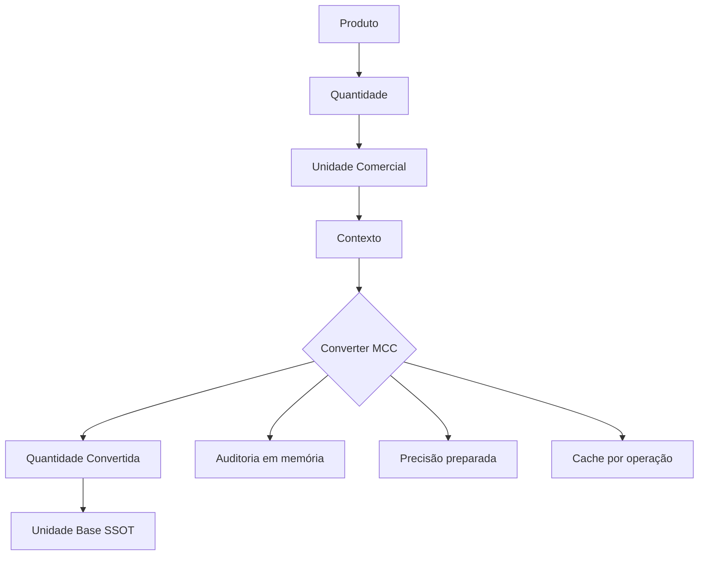
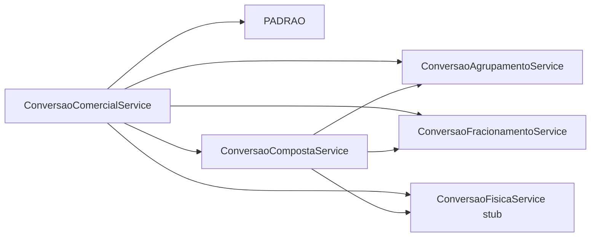
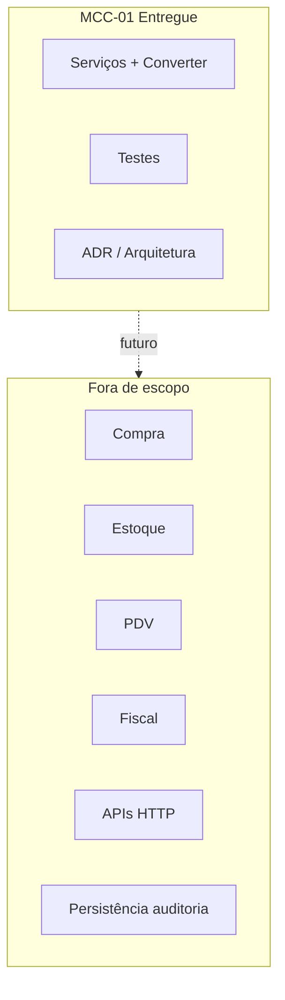

# DIAGRAMA — Motor de Conversão Comercial (MCC-01)

## Fluxo oficial



## Tipos e serviços



## Conversão composta (arquitetura)

```
Caixa ──AGRUPAMENTO──► Litro ──CONVERSAO_FISICA──► Kg
                              (ainda não implementada)
```

MCC-01 executa elos comerciais da cadeia; elos físicos retornam status `PENDENTE_ARQUITETURA` / HTTP lógico 501.

## Princípio da plataforma

```
Produto
  └── Unidade Base (SSOT)
  └── Unidades de Comercialização (UC-01)  × N
  └── Motor de Conversão Comercial (MCC)   × 1
```

## Fronteira desta sprint


