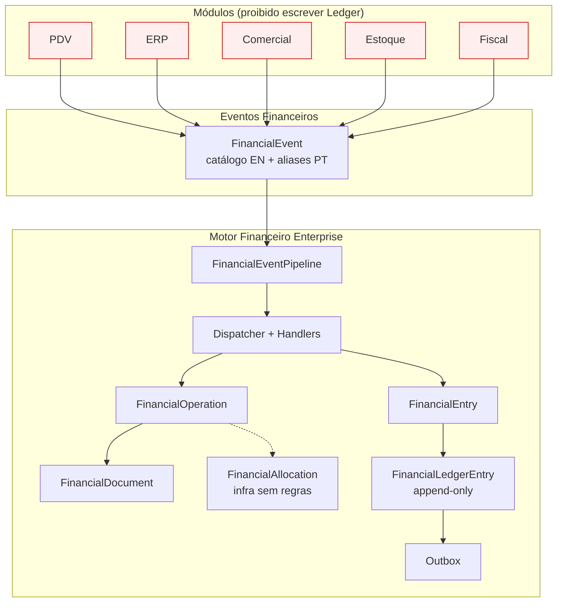

# DIAGRAMA — MFE-03 Modelo Financeiro Unificado



## Fluxo oficial

```
Módulo → FinancialEvent → Pipeline → (Operation/Document) → Entry → Ledger → Outbox
```

## Proibido

```
Módulo → Ledger
```
