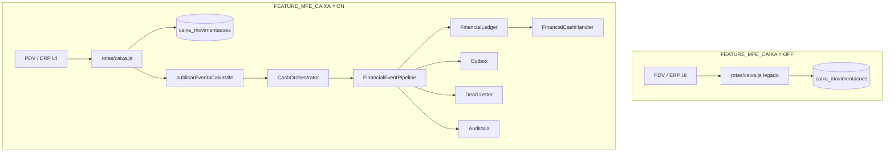

# DIAGRAMA — MFE-04 Caixa Operacional


```mermaid
flowchart TB
  UI[PDV / ERP UI]
  ROTAS[rotas/caixa.js legado]
  TAB[(caixa_movimentacoes)]

  subgraph FlagOFF["FEATURE_MFE_CAIXA = OFF"]
    UI --> ROTAS --> TAB
  end

  subgraph FlagON["FEATURE_MFE_CAIXA = ON"]
    UI2[PDV / ERP UI] --> ROTAS2[rotas/caixa.js]
    ROTAS2 --> TAB2[(caixa_movimentacoes)]
    ROTAS2 --> PUB[publicarEventoCaixaMfe]
    PUB --> ORCH[CashOrchestrator]
    ORCH --> PIPE[FinancialEventPipeline]
    PIPE --> LEDGER[FinancialLedger]
    LEDGER --> CASH[FinancialCashHandler]
    PIPE --> OUT[Outbox]
    PIPE --> DL[Dead Letter]
    PIPE --> AUD[Auditoria]
  end
```

## Princípio

```
Evento → Pipeline → Ledger → CashHandler → projeção/auditoria
```

Proibido: Caixa → Ledger direto.
