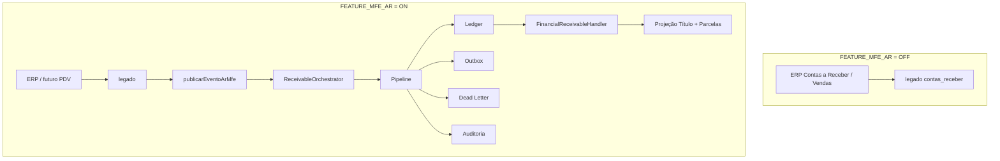

# DIAGRAMA — MFE-05 Contas a Receber


```mermaid
flowchart TB
  UI[ERP Contas a Receber / Vendas]
  LEG[legado contas_receber]

  subgraph OFF["FEATURE_MFE_AR = OFF"]
    UI --> LEG
  end

  subgraph ON["FEATURE_MFE_AR = ON"]
    UI2[ERP / futuro PDV] --> LEG2[legado]
    LEG2 --> PUB[publicarEventoArMfe]
    PUB --> ORCH[ReceivableOrchestrator]
    ORCH --> PIPE[Pipeline]
    PIPE --> LEDGER[Ledger]
    LEDGER --> ARH[FinancialReceivableHandler]
    ARH --> TIT[Projeção Título + Parcelas]
    PIPE --> OUT[Outbox]
    PIPE --> DL[Dead Letter]
    PIPE --> AUD[Auditoria]
  end
```

## Princípio

```
Evento → Pipeline → Ledger → ReceivableHandler → Título
```

Proibido: módulo → INSERT financeiro / Ledger direto.
