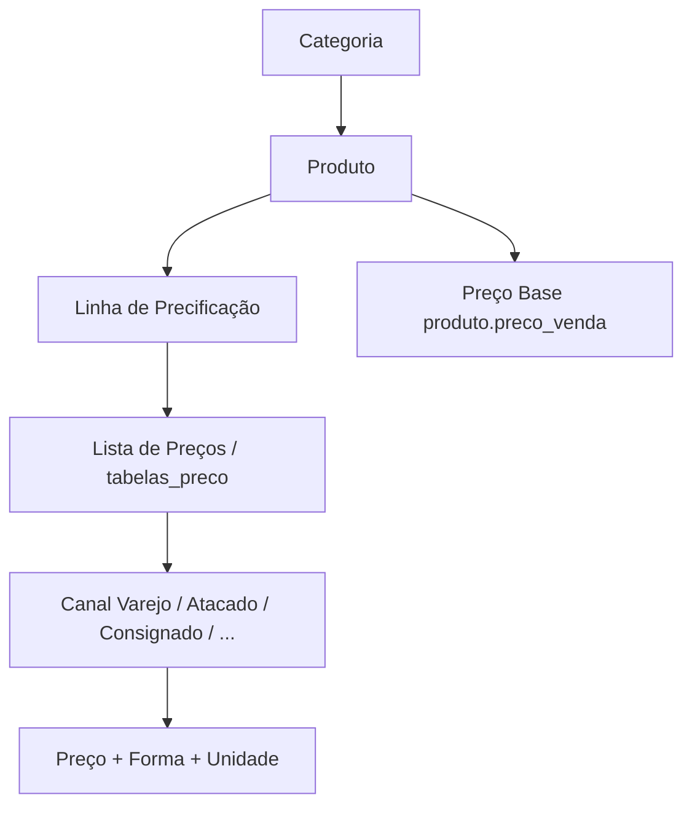
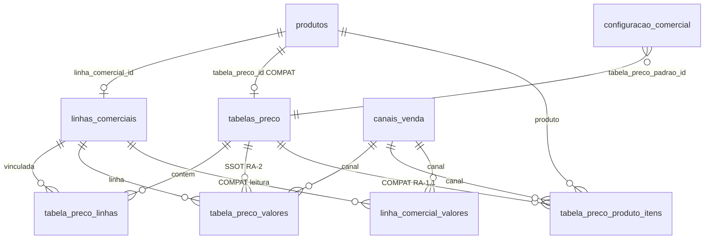
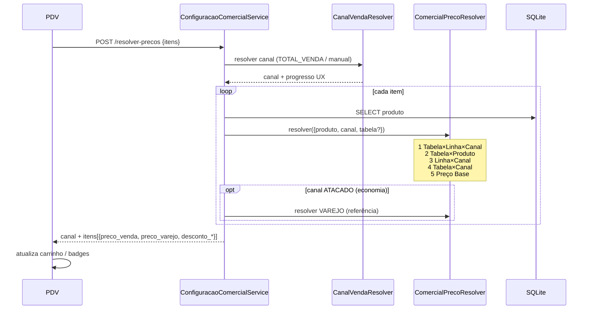

# AUDITORIA ARQ-RA — Arquitetura Completa do Sistema de Precificação CDS

| Campo | Valor |
|---|---|
| Tipo | Auditoria arquitetural (sem implementação) |
| Data | 2026-08-06 |
| Escopo | RA-1 → RA-2 → RA-4 → RA-5 + Resolver + PDV + Atacado + Consignação |
| Restrição | Não altera código, migrations, banco, APIs nem UI |
| Parecer final | **B — Evoluir arquitetura atual** |

---

## Sumário executivo

O domínio oficial RA-2 (`Produto → Linha → Tabela/Lista → Canal → Preço`) é **tecnicamente coerente** e escala bem no banco. O problema principal não é o fato relacional — é a **camada de apresentação + herança de modelos paralelos**.

Hoje coexistem:

1. **SSOT pretendido:** `tabela_preco_valores` (Lista × Linha × Canal)
2. **Compat RA-1.1:** `tabela_preco_produto_itens` (Lista × Produto × Canal)
3. **Compat A-1 / Política:** `linha_comercial_valores` (Linha × Canal)
4. **Fallback:** `produto.preco_venda`

Isso gera dúvida operacional real (“o que é a verdade?”), UX matricial que **não escala** com milhares de linhas, e um modelo mental que **nem sempre** bate com o que o empresário espera (“Tabela Varejo / Tabela Atacado”).

**Conclusão:** não redesenhar do zero antes da homologação; **evoluir** — congelar SSOT, limpar legado, e decidir a metáfora UX (matriz multi-canal vs lista por canal) sem destruir o Resolver.

---

## 1. Modelo mental

### Modelo atual (implementado / comunicado)



Na tela (RA-4/RA-5), a metáfora é uma **planilha**:

| Linha | Forma | Unidade | Varejo | Atacado | Consignado | Evento |
|---|---|---|---|---|---|---|
| PICOLÉS ESPECIAIS | UNIDADE | UN | 3,00 | 1,50 | 1,50 | 2,50 |

### O que o empresário costuma esperar

```text
Tabela Varejo          Tabela Atacado         Tabela Consignado
───────────────        ───────────────        ────────────────
Linha | Preço          Linha | Preço          Linha | Preço
Forma | Unidade        Forma | Unidade        Forma | Unidade
```

### Parecer do modelo mental

| Critério | Avaliação |
|---|---|
| Intuitivo para time técnico / pricing engine | ✔ Bom (dimensão canal explícita) |
| Intuitivo para empresário de balcão | ⚠ Parcial — ele pensa em “lista do canal”, não em “matriz de canais” |
| Alinhado a PDV (canal muda na venda) | ✔ Canal como dimensão de runtime faz sentido |
| Risco de confusão de vocabulário | Alto — “Tabela/Lista”, “Linha”, “Política”, “Canal” |

**Veredito §1:** o modelo **relacional** atual é defensável; a **metáfora UX** (matriz multi-canal) é o ponto frágil. Muitos empresários esperam Modelo B de apresentação (“uma lista por canal”), mesmo que o banco continue com canal como coluna/dimensão.

---

## 2. Escalabilidade (UX da Lista)

Simulação sobre a tela atual (`tabelas-preco-ra2.js`): DOM com 1 linha × N colunas de canal; busca de linhas só aparece acima de 6 itens; sticky em cabeçalho/coluna; **sem virtualização**.

| Cenário | Células (ex.: 4 canais) | UX esperada |
|---|---|---|
| 100 linhas | ~400 inputs | Utilizável com busca; rolagem moderada |
| 500 linhas | ~2.000 inputs | Lenta para abrir/salvar; difícil localizar sem busca forte |
| 1.000 linhas | ~4.000 inputs | Fronteira de usabilidade no browser; risco de travar |
| 5.000 linhas | ~20.000 inputs | **Inutilizável** na planilha atual |
| 50 canais × 300 linhas | 15.000 inputs | Colapso horizontal + vertical |

### Perguntas objetivas

| Pergunta | Resposta |
|---|---|
| A tela continua utilizável? | Até ~100–200 linhas com poucos canais. Acima disso, não. |
| Edição continua rápida? | Payload `substituirValores` apaga/reinsere todos os valores da lista → degrada com volume. |
| Localizar linha rapidamente? | Busca existe, mas fraca para milhares; sem paginação server-side na grade. |
| Excesso de rolagem? | Sim — cresce com linhas × canais. |

**Veredito §2:** o **banco** aguenta 5.000 linhas; a **UX matricial atual não**. Escalabilidade de produto exige evolução de UI (virtualização, edição por linha, lista por canal, ou paginação), não necessariamente novo domínio.

---

## 3. Responsabilidade — Tabela × Canal

### Opção 1 — Tabela possui vários canais (atual)

```text
Lista "PADRAO"
  ├─ Varejo
  ├─ Atacado
  ├─ Consignado
  └─ Evento
```

| Prós | Contras |
|---|---|
| Uma lista = política comercial completa | Matriz larga e pesada |
| Comparar canais lado a lado | Empresário “perde” o canal no meio das colunas |
| Canal muda no PDV sem trocar de lista | Mistura responsabilidades de “catálogo” e “canal” |
| Menos entidades `tabelas_preco` | Risco de editar o canal errado |

### Opção 2 — Tabela pertence a UM canal

```text
Lista Varejo     Lista Atacado     Lista Consignado
(canal fixo)     (canal fixo)      (canal fixo)
```

| Prós | Contras |
|---|---|
| Modelo mental do empresário | Mais cadastros / mais IDs |
| UX estreita (Linha + Preço) | Comparar canais exige abrir várias listas |
| Escala vertical melhor | PDV precisa escolher lista **e** canal (ou derivar um do outro) |
| Permissões por canal mais simples | Risco de divergência Forma/Unidade entre listas |

**Veredito §3:**  
- **Domínio ideal:** preço é fato `(lista_contexto, linha, canal)` — multi-canal no fato é correto.  
- **Cadastro ideal para o usuário:** pode **parecer** mono-canal (Opção 2 na UX) sem forçar Opção 2 no banco.  
Não é obrigatório “Tabela = 1 canal” no schema; é obrigatório **decidir a metáfora** e não misturar as duas na mesma tela sem filtro.

---

## 4. Modelo de banco — mapa completo

### Diagrama de persistência



### Papel de cada artefato

| Artefato | Papel atual | Status |
|---|---|---|
| `tabelas_preco` | Cabeçalho da Lista de Preços (contexto) | Ativo / oficial |
| `tabela_preco_linhas` | Quais linhas entram na lista | Ativo / oficial |
| `tabela_preco_valores` | Preço oficial Lista × Linha × Canal (+ forma/unidade) | **SSOT pretendido** |
| `tabela_preco_produto_itens` | Preço Lista × Produto × Canal | Compat RA-1.1 (ainda no Resolver #2) |
| `linhas_comerciais` | Cadastro da Linha de Precificação | Ativo (nome legado) |
| `linha_comercial_valores` | Preços da antiga Política | **Legado leitura**; escrita oficial RA-2 parou |
| `produtos.preco_venda` | Preço Base / fallback | Ativo necessário |
| `produtos.tabela_preco_id` | Produto escolhia tabela | **Compat**; RA-2 usa contexto/config |
| `produtos.linha_comercial_id` | Vínculo Produto → Linha | Oficial RA-2 |
| `canais_venda` | Dimensão de venda | Oficial |
| `configuracao_comercial.tabela_preco_padrao_id` | Contexto padrão da venda | Oficial RA-2 |
| `produto_atacado` | Faixas legado por produto | Paralelo (se config comercial off) |

### Duplicidade / redundância / escrita

| Problema | Evidência | Risco |
|---|---|---|
| Três fontes de preço tipadas | `tabela_preco_valores` + `tabela_preco_produto_itens` + `linha_comercial_valores` | Resolver “escolhe” por ordem — operador não vê qual venceu |
| Espelho RA-1.1 → valores canal-only | `sincronizarCompatValoresCanal` grava em `tabela_preco_valores` sem linha | Polui SSOT com linhas `linha_comercial_id` null |
| Ordem do Resolver com 5 degraus | RA-2 → produto → linha → tabela×canal → base | Complexidade cognitiva e bugs de homologação |
| Sync antigo Política ↔ Tabela | migrations/testes ainda citam sync | Confusão “o que ainda escreve?” |
| Nomenclatura | UI “Lista”, API `tabelas-preco`, domínio “Linha” = antiga Política | Onboarding difícil |

**Veredito §4:** há **duplicidade real** e **tabelas em modo legado**. Não há necessidade de novo schema “do zero”; há necessidade de **congelar SSOT** e plano de depreciação.

---

## 5. Linha de Precificação — necessária?

### O que ela resolve

Agrupa produtos que **compartilham a mesma estratégia de preço** (ex.: “Picolé Premium”, “Sorvete KG”). Evita cadastrar preço canal a canal em cada SKU.

### Respostas objetivas

| Pergunta | Resposta |
|---|---|
| Continua necessária? | **Sim**, como conceito de domínio (grupo de precificação). |
| Pode desaparecer? | Só se o negócio aceitar precificar **por produto** (explode cadastro) ou por categoria (mistura taxonomia com preço). |
| Deve aparecer para o usuário? | **Sim**, com nome claro (“Linha de Precificação” / “Grupo de preço”). Não como “Política Comercial”. |
| Pode ser só interna? | Não recomendado — o usuário precisa saber *por que* dois produtos têm o mesmo preço de atacado. |

**Veredito §5:** manter Linha. Remover seria regressão ao caos Produto×Canal ou Categoria×Preço.

---

## 6. Produto — vínculo natural

### Hoje (RA-2)

```text
Produto → Linha → (contexto) Lista → Canal → Preço
         ↘ Preço Base
```

Produto **não escolhe** Lista; a venda/contexto escolhe.

### Alternativa sugerida na pergunta

```text
Produto → Tabela → Preço Base
```

### Comparação

| Critério | Produto → Linha → Lista | Produto → Tabela |
|---|---|---|
| Manutenção de 200 SKUs iguais | ✔ Altera 1 linha | ✖ Altera 200 itens |
| Exceção de 1 SKU | Precisa exceção (hoje: compat produto ou preço base) | ✔ Natural |
| Quem define a lista ativa | Contexto / config | Produto (rígido) |
| Alinhamento PDV multi-canal | ✔ | ⚠ Produto “preso” a uma tabela |

**Veredito §6:**  
`Produto → Linha` é o vínculo **certo para escala comercial**.  
`Produto → Tabela` era o modelo RA-1.1 e **não** é mais natural para Cremolicia (muitos SKUs, poucos grupos de preço).  
Preço Base no produto permanece como **âncora/fallback**, não como SSOT por canal.

Exceções pontuais (SKU fora da linha) devem ser política explícita futura — não motivo para voltar Produto→Tabela como regra.

---

## 7. Natureza do Canal

### O que o Canal é hoje

| Papel | Uso |
|---|---|
| Dimensão de preço | Coluna em `tabela_preco_valores` |
| Contexto de runtime | `CanalVendaResolver` (Varejo↔Atacado automático; Evento manual) |
| Tipo cadastral | Entidade `canais_venda` |
| **Não é** | Uma Tabela por si só |

### Comparação A / B / C

```text
A) Lista → Canal → Preço     (atual no fato + UX matriz)
B) Canal → Lista → Preço     (canal escolhe qual lista)
C) Uma lista por canal       (metáfora B + cadastro mono-canal)
```

| | Complexidade | UX empresário | PDV | Escala |
|---|---|---|---|---|
| **A** | Média | ⚠ Matriz | ✔ Canal muda preço na mesma lista | Banco ✔ / UI ✖ |
| **B** | Alta (dois eixos) | Confusa se ambos forem editáveis | Precisa resolver lista+canal | Risco de over-engineering |
| **C** | Baixa na cabeça do usuário | ✔ | Lista padrão por canal ou config | UI ✔ se bem feita |

**Veredito §7:** Canal é **dimensão + contexto de runtime**, não “tipo de tabela”.  
A apresentação **C** (lista por canal) pode ser a UX oficial; o fato pode continuar **A**. Evitar **B** como modelo mental duplo (pior dos mundos).

---

## 8. PDV — Resolver

### Fluxo atual



### Fluxo ideal (alvo evolutivo)

1. Resolver **canal uma vez** (já ocorre).  
2. Resolver **tabela de contexto uma vez**.  
3. Batch de preços: `IN (linha_ids)` / cache aquecido por Lista×Canal.  
4. Uma origem oficial (`tabela_preco_linha`); fallback só Preço Base.  
5. Economia atacado: `preco_varejo` no mesmo batch, sem N consultas extras cegas.

### Problemas observados

| Problema | Impacto |
|---|---|
| N produtos × até 5 tentativas + resolve VAREJO | Excesso de consultas no carrinho grande |
| Caminhos sync (`obterPrecoVenda`) incompletos vs async | Equipamentos/etiquetas podem divergir do PDV |
| Dois modos de atacado (faixas `produto_atacado` × canal comercial) | Comportamento diferente conforme config |
| Compat layers no hot path | Homologação difícil (“qual origem?”) |

**Veredito §8:** o fluxo **conceitual** (canal → preço por canal) está certo; a **implementação** está sobrecarregada de compatibilidade e consultas. Evoluir o Resolver, não reinventar o PDV.

---

## 9. Atacado — auditoria completa

### Mecanismos paralelos

| Mecanismo | Quando | Unidade de decisão | Efeito |
|---|---|---|---|
| Config Comercial (`atacado_habilitado`) | Preferencial | Carrinho (elegíveis) → canal ATACADO | Troca preço via Resolver |
| Faixas `produto_atacado` | Se config off + `venda_atacado` | Por produto / quantidade da linha | Preço e `desconto_atacado` legado |

### Contagem oficial (Config Comercial)

| `tipo_contagem` | Regra |
|---|---|
| `TOTAL_VENDA` (padrão) | Soma quantidades de itens com `participa_atacado = 1` |
| `POR_PRODUTO` | **Cada** produto elegível precisa atingir o mínimo |

Flags: `permitir_produtos_diferentes`, `permitir_categorias_diferentes`.

### Exemplo real (30 unidades misturando elegíveis)

```text
Picolé Premium  × 10
Picolé Comum    × 12
Casquinha       × 8
Total elegível  = 30  (≥ mínima)
```

| Regra | Resultado com `TOTAL_VENDA` + mín. 30 |
|---|---|
| Oficial desejada | **Canal ATACADO para o carrinho**; cada item resolve preço ATACADO da sua Linha |
| `POR_PRODUTO` mín. 30 | **Não atinge** (nenhum SKU sozinho tem 30) |

### O que NÃO é a regra hoje (modo comercial)

- Não é “desconto por linha de precificação” como agregador.
- Não é automático por item isolado (exceto modo `POR_PRODUTO` / faixas legado).
- É **por carrinho** (quantidade elegível) → **canal** → **preço por item via Linha×Canal**.

**Veredito §9 — regra oficial recomendada:**

> **Atacado = contexto de canal da venda.**  
> Contagem padrão: **TOTAL_VENDA** sobre itens `participa_atacado`.  
> Produtos mistos elegíveis **somam**.  
> Ao atingir o mínimo, **todo o carrinho** opera no canal ATACADO; o preço de cada item vem da Lista×Linha×ATACADO (não de uma média).  
> Faixas `produto_atacado` devem ser tratadas como legado a desligar após homologação da config comercial.

---

## 10. Consignação

### Estado atual (evidência)

- UI `NovaConsignacao` chama `resolverPrecosVenda`.
- Em trechos do fluxo, canal é forçado/assumido como **VAREJO**.
- Existe (ou pode existir) canal **CONSIGNADO** em `canais_venda` e coluna na matriz da Lista.
- Perfil comercial do cliente = `CONSIGNADO` (perfil operacional ≠ preço).

### Precisa de quê?

| Necessidade de negócio | Artefato adequado |
|---|---|
| Preço diferente do varejo na entrega | **Canal CONSIGNADO** (ou Lista mono-canal Consignado) com preços na SSOT |
| Regras de crédito / prazo / saldo | Perfil / Motor Comercial — **não** tabela de preço |
| Tabela 100% isolada | Só se a operação for outro “catálogo” (raro); em geral canal basta |

**Veredito §10:** consignação precisa de **preço próprio via Canal (ou lista por canal)**, não necessariamente de uma entidade “Tabela Consignação” separada da arquitetura. Misturar perfil operacional com precificação gera falso requisito.

---

## 11. Performance — Modelo atual × Uma tabela por canal

| Dimensão | Modelo A (Lista multi-canal) | Modelo C (1 lista / canal) |
|---|---|---|
| Consulta Resolver | 1 lookup `(lista, linha, canal)` | Igual se schema for o mesmo; se listas distintas, lookup `(lista_do_canal, linha)` |
| Payload save | 1 POST com matriz L×C | C POSTs menores / payloads estreitos |
| Frontend | Matriz larga; DOM explode | Grades estreitas; mais navegação entre listas |
| Cache | Chave `TL:lista:linha:canal` | Pode cachear por lista (já mono-canal) |
| Banco | 1 fato normalizado | Ou 1 fato com `canal_id` na lista, ou N listas |
| Complexidade domínio | Canal dimensão | Canal “embutido” no cabeçalho da lista |

**Veredito §11:** performance de **leitura** é similar se o fato continuar normalizado. A vitória de “uma tabela por canal” é **frontend e payload de edição**, não magia no SQLite.

---

## 12. UX — auditoria exclusiva da tela

### Estado RA-5

- Metáfora: planilha matricial Linha × Canais  
- Busca de linhas (threshold baixo)  
- Sticky coluna Linha  
- Máscara pt-BR, atalhos teclado  
- KPI resumo + área “Regras Futuras”  
- Sem virtualização / paginação da grade

### Respostas

| Pergunta | Resposta |
|---|---|
| Escala? | Não para milhares de linhas |
| Intuitiva? | Para quem compara canais lado a lado, sim; para quem pensa “Tabela Atacado”, não |
| Excesso de informação? | Sim quando há muitos canais + forma/unidade por célula |
| Excesso de colunas? | Sim a partir de ~6–8 canais |
| 3.000 linhas? | Inviável sem redesign UX |
| 50 canais? | Inviável na matriz; exige filtro “canal ativo na edição” ou lista por canal |

---

## 13. Comparação Modelo A × Modelo B

### MODELO A — atual (domínio + UX matriz)

```text
Tabela/Lista
  └─ Linhas
      └─ Vários Canais
          └─ Preços
```

### MODELO B — “uma tabela por canal” (metáfora empresário)

```text
Tabela Varejo | Tabela Atacado | Tabela Consignado | Tabela Delivery
Cada uma: Linha | Preço | Forma | Unidade
```

| Critério | Modelo A | Modelo B (apresentação) |
|---|---|---|
| Complexidade domínio | Média (bem modelada) | Baixa na cabeça; média se virar N entidades soltas |
| Escalabilidade banco | Alta | Alta (se bem implementado) |
| Escalabilidade UX | Baixa na matriz | Alta por lista estreita |
| Banco | SSOT único com canal | Pode ser o **mesmo SSOT** com UX filtrada **ou** `tabelas_preco.canal_id` |
| PDV | Natural (troca canal) | Natural se lista padrão = f(canal) |
| Resolver | Já preparado | Simplifica se remover compat |
| Performance UI | Pior | Melhor |
| Facilidade usuário | ⚠ | ✔ na maioria dos cases Cremolicia |
| Facilidade manutenção | Sofre com legado | Sofre se duplicar listas sem sincronizar Linha/Forma |

### Síntese

- **A no domínio** é sólido.  
- **B na UX** é o que o empresário pede.  
- Tratar B como **redesenho total do domínio** é erro caro.  
- Tratar B como **evolução de metáfora + limpeza de legado** é o caminho certo.

---

## 14. Parecer final (uma opção)

### Opções

| | Opção |
|---|---|
| A | Manter arquitetura atual |
| **B** | **Evoluir arquitetura atual** |
| C | Redesenhar completamente antes da homologação |

### Escolha: **B — Evoluir arquitetura atual**

### Por que não A

Manter “como está” homologa uma UX que não escala, um Resolver com 5 origens e dois modos de atacado. A dúvida do teste real (“isso escala?”) permaneceria aberta.

### Por que não C

Redesenhar do zero antes da homologação:

- Descarta investimento RA-2/4/5 válido no domínio Linha  
- Aumenta risco em PDV, consignação, config comercial  
- O problema central é **legado + metáfora UX**, não um domínio irreparável  

### O que “evoluir” significa (somente direção — sem implementar aqui)

1. **Congelar SSOT:** `tabela_preco_valores` (Lista × Linha × Canal).  
2. **Deprecar leitura/escrita** de `linha_comercial_valores` e, em seguida, `tabela_preco_produto_itens` no hot path.  
3. **UX:** metáfora “editar por canal” (Modelo B visual) **ou** matriz virtualizada com canal filtrável — decisão de produto.  
4. **Atacado oficial:** `TOTAL_VENDA` + canal; desligar faixas legado após corte.  
5. **Consignação:** preço via canal CONSIGNADO / lista filtrada — não entidade paralela.  
6. **Resolver:** batch + uma origem oficial + Preço Base.  
7. **Homologação:** gate por origem única observável no log (`tabela_preco_linha`).

---

## Riscos se homologar sem evoluir

| Risco | Severidade |
|---|---|
| Operador não sabe qual origem de preço venceu | Alta |
| Matriz trava com crescimento de linhas/canais | Alta |
| Atacado legado ≠ atacado comercial em lojas mistas | Alta |
| Consignação “no varejo” com coluna consignado sem uso | Média |
| Sync/espelhos gerarem preço fantasma | Média |
| Vocabulário Lista/Tabela/Linha/Política | Média (treino) |

---

## Recomendação para o gate de homologação

| Gate | Critério |
|---|---|
| Pode homologar domínio Linha? | **Sim**, com ressalva de limpeza de legado |
| Pode homologar UX matriz como definitiva? | **Não** para >~200 linhas / muitos canais |
| Pode iniciar “RA redesign total”? | **Não** |
| Próximo passo correto | Sprint de **evolução arquitetural** (SSOT + UX metáfora + Resolver), documentada, ainda sem big-bang |

---

## Anexos — fluxos de referência

### A. Cadastro mental recomendado (evolução)

```text
1. Cadastrar Linhas de Precificação (grupos)
2. Vincular Produto → Linha (+ Preço Base)
3. Manter Lista(s) de contexto (ex.: PADRAO / EVENTO_ESPECIAL)
4. Informar preços:
     - Preferência UX: por canal (aba Varejo | Atacado | Consignado)
     - Persistência: mesmo fato Lista×Linha×Canal
5. Config Comercial: lista padrão + regras de atacado
```

### B. Resolução ideal no PDV

```text
Carrinho → CanalVendaResolver → canal
        → Lista contexto (config / evento)
        → Para cada item: preço (Lista, Linha do produto, Canal)
        → Se ATACADO: exibir economia vs VAREJO
        → Fallback único: produto.preco_venda
```

### C. Inventário de decisões abertas (produto, não código)

1. UX oficial: matriz filtrável × abas por canal × listas mono-canal?  
2. Exceção SKU fora da Linha: permitida? como?  
3. Data de morte do `produto_atacado` e de `tabela_preco_produto_itens`.  
4. Consignação: sempre canal CONSIGNADO ou lista própria de contexto?

---

**Fim da auditoria.** Nenhuma alteração de código, migration, banco, API ou UI foi feita neste entregável.
