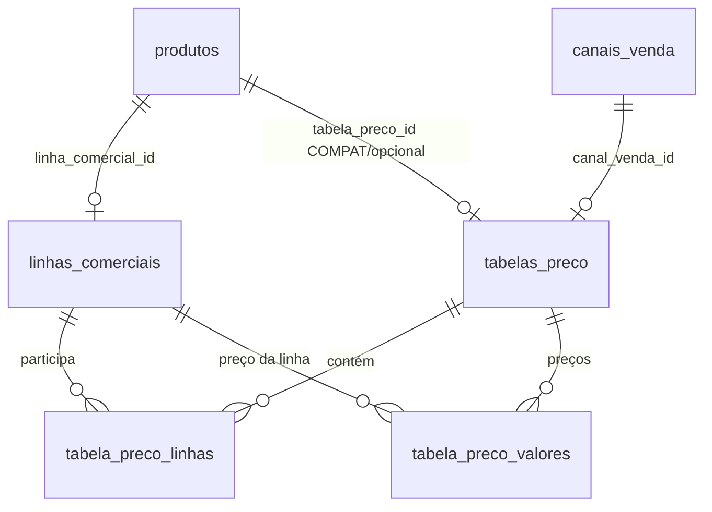
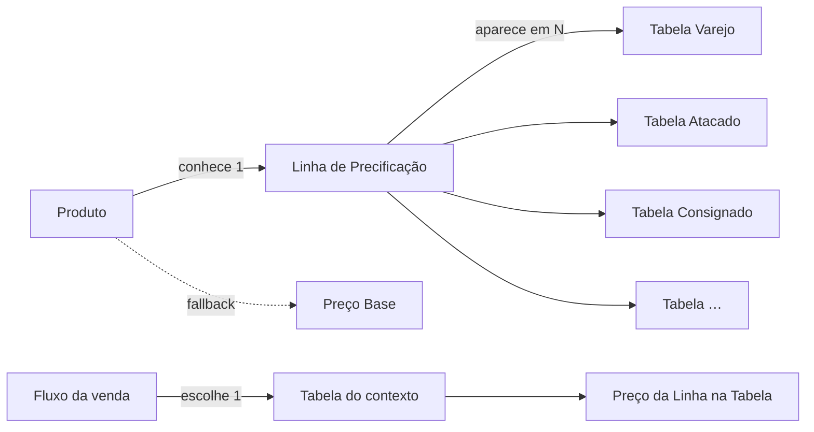
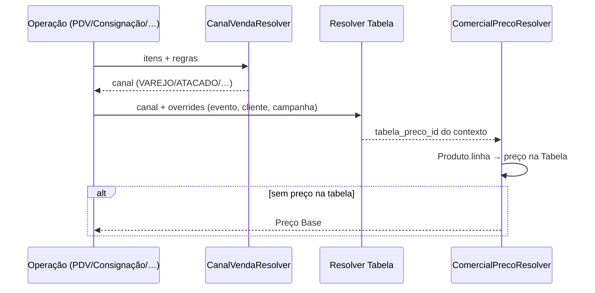

# AUDITORIA RA-6.2 — Grafo Oficial da Precificação CDS

| Campo | Valor |
|---|---|
| Tipo | Auditoria arquitetural (sem implementação) |
| Data | 2026-08-06 |
| Base | RA-6 + Auditoria ARQ-RA |
| Restrição | Não altera código, migrations, banco, APIs nem UI |
| Parecer final | **C — Linha é o único elo entre Produto e todas as Tabelas** |

---

## Sumário executivo

O risco de escalabilidade está correto: se o **Produto** precisar “conhecer” dezenas/centenas de Tabelas (Varejo, Atacado, Delivery, Marketplace…), o cadastro explode e o modelo morre.

O agregador oficial da precificação **não é a Tabela**. É a **Linha de Precificação**.

| Papel | Entidade |
|---|---|
| O que o produto é comercialmente (grupo de preço) | **Linha** |
| Em que contexto a venda acontece | **Tabela** (1 canal / contexto) |
| Quem escolhe a tabela na hora da venda | **Fluxo da venda** (PDV / Motor / canal / evento) |
| Âncora / fallback | **Preço Base** no produto |

```text
Produto ──conhece──► Linha
Linha ◄──contém──► Tabela₁, Tabela₂, … Tabelaₙ
Venda ──escolhe──► Tabela (pelo canal/contexto)
Resolver: Produto → Linha → Tabela(contexto) → Preço → Preço Base
```

`produto.tabela_preco_id` (opcional na RA-6) é **compatibilidade / override pontual**, não o elo estrutural.

---

## 1. Hoje — quem conhece quem?

### Grafo atual (pós RA-6)



### Mapa objetivo

| De → Para | Existe? | Como |
|---|---|---|
| Produto → Linha | **Sim** | `produtos.linha_comercial_id` (oficial) |
| Linha → Produto | **Não direto** | Só via query inversa `WHERE linha_comercial_id = ?` |
| Tabela → Linha | **Sim** | `tabela_preco_linhas` + `tabela_preco_valores` |
| Linha → Tabela | **Não como FK única** | N:N: uma linha pode estar em várias tabelas |
| Produto → Tabela | **Sim (opcional/compat)** | `produtos.tabela_preco_id` |
| Tabela → Produto | **Não** (oficial RA-6) | Compat RA-1.1 ainda tem `tabela_preco_produto_itens` |
| Venda/Resolver → Tabela | **Sim** | contexto / canal / config / override |

### Leitura

- O vínculo **estrutural** Produto↔Precificação já é a **Linha**.
- O vínculo Produto↔Tabela ainda existe no schema/UI como opcional — e é exatamente o ponto que **não escala** se for tratado como obrigatório.

---

## 2. Quem deveria conhecer quem? (ideal)



| Relação ideal | Cardinalidade | Dono |
|---|---|---|
| Produto → Linha | N:1 | Cadastro de Produto |
| Tabela → Linhas | N:N | Cadastro de Tabela de Preços |
| Venda → Tabela | 1 por contexto | PDV / Motor / Canal / Config |
| Linha × Tabela → Preço | 1 valor | Editor da Tabela |

**Regra de ouro:** o Produto **nunca** lista tabelas. A Tabela **lista** linhas. A Venda **escolhe** a tabela.

---

## 3. O que é a Linha de Precificação?

| Opção | Avaliação |
|---|---|
| A) Grupo de Produtos | Parcial — agrupa, mas o motivo do agrupamento é preço |
| B) Estratégia Comercial | Parcial — próximo, mas “estratégia” sugere regras (desconto, campanha) |
| C) Grupo de Precificação | **Melhor definição** |
| D) Outra coisa | — |

**Resposta: C (com nuance de A).**

A Linha é o **grupo de precificação**: conjunto de produtos que compartilham a mesma célula de preço em qualquer tabela/contexto.

Não é categoria (taxonomia). Não é canal. Não é a tabela. Não é promoção.

Ex.: `PICOLÉS PREMIUM` → todos os SKUs dessa linha têm o mesmo preço de varejo, o mesmo de atacado, o mesmo de delivery — definidos **nas tabelas**, não no produto.

---

## 4. O que é a Tabela de Preços?

| Opção | Avaliação |
|---|---|
| A) Uma coleção de preços | Verdadeiro, mas incompleto |
| B) Um contexto comercial | **Melhor definição** |
| C) Um canal de venda | Quase — na RA-6 a tabela **tem** um canal, mas não **é** o canal |
| D) Outro | — |

**Resposta: B (contexto comercial mono-canal).**

Na RA-6:

```text
Tabela = contexto comercial tipado por Canal
         (Varejo, Atacado, Consignado, Delivery, Marketplace…)
       + coleção de preços das Linhas nesse contexto
       + regras (ex.: atacado na Tabela Atacado)
```

O **Canal** é a dimensão/runtime. A **Tabela** é o artefato cadastral do contexto (pode haver mais de uma tabela por canal no futuro — sazonal, cliente especial — sem o produto saber).

---

## 5. O Produto precisa conhecer uma Tabela?

**Não.** Basta conhecer a **Linha de Precificação**.

| Se o produto conhece Tabela | Problema |
|---|---|
| 1 tabela fixa | Quebra multi-canal (atacado/consignado/delivery) |
| N tabelas no produto | Cadastro inviável com 50–200 tabelas |
| Tabela “preferencial” | Confunde com contexto da venda; vira override silencioso |

`tabela_preco_id` no produto só se justifica como **exceção rara** (override), nunca como modelo mental oficial.

---

## 6. Exemplo real — Picolé Premium

```text
Produto:  Picolé Premium Chocolate
Linha:    PICOLÉS PREMIUM

Tabelas existentes:
  Tabela Varejo
  Tabela Atacado
  Tabela Delivery
  Tabela Consignado
  Tabela Evento
```

### O produto NÃO deve armazenar

```text
❌ Tabela Varejo
❌ Tabela Atacado
❌ Tabela Consignado
❌ …
```

### O produto DEVE armazenar

```text
✔ Linha = PICOLÉS PREMIUM
✔ Preço Base = fallback (ex.: 3,00)
```

### Onde ficam os preços

| Tabela | Linha PICOLÉS PREMIUM |
|---|---|
| Varejo | 3,00 |
| Atacado | 1,50 |
| Delivery | 3,50 |
| Consignado | 2,80 |
| Evento | 2,50 |

**Justificativa:** ao criar a 11ª tabela (Marketplace), **zero** alteração no produto. Só se adiciona a linha na nova tabela (ou em lote por linha).

---

## 7. Resolver — quem escolhe a Tabela?

| Candidato | Deve escolher? |
|---|---|
| Produto | **Não** |
| Canal sozinho | Indica o contexto, mas não é o artefato de preço |
| PDV | Dispara o fluxo; não “cadastra” a tabela |
| Motor Comercial | Pode forçar contexto (ex.: consignação → CONSIGNADO) |
| Pricing Engine | Futuro orquestrador — recebe contexto |
| **Fluxo da venda** | **Sim** — agrega canal + regras + overrides |

### Fluxo ideal



Ordem ideal de escolha da tabela:

1. Override explícito da operação (evento, campanha, cliente VIP)  
2. Tabela ativa do **canal** resolvido  
3. Configuração padrão do contexto  
4. Preço Base  

O produto **não** entra nessa lista (exceto override legado a deprecar).

---

## 8. Escalabilidade

| Cenário | Produto→Tabela (errado) | Produto→Linha + Tabela←Linhas (certo) |
|---|---|---|
| 100 produtos / 5 tabelas | Chato, ainda funciona | Simples |
| 5.000 produtos / 50 tabelas | 250k vínculos mentais | 5.000 vínculos produto→linha |
| 5.000 produtos / 200 tabelas | Colapso de cadastro | Ainda 5.000 vínculos; tabelas editam linhas |
| 100 linhas / 50 tabelas | — | Grade por tabela: 100 linhas (virtualizada) |
| 500 linhas / 200 tabelas | — | Trabalhoso na tabela, **não** no produto |

**O que continua simples:** Produto conhece **1 Linha**. Tabela conhece **N Linhas**. Venda escolhe **1 Tabela**.

---

## 9. Banco — circularidade / redundância / inversão

### Mapa

```text
produtos.linha_comercial_id          → linhas_comerciais.id     (oficial)
produtos.tabela_preco_id             → tabelas_preco.id         (compat/opcional)
tabela_preco_linhas                  → tabela × linha           (oficial N:N)
tabela_preco_valores                 → tabela × linha × canal   (SSOT preço)
tabela_preco_produto_itens           → tabela × produto × canal (legado RA-1.1)
linha_comercial_valores              → linha × canal            (legado leitura)
```

| Problema | Existe? | Nota |
|---|---|---|
| Dependência circular | **Não** | Grafo é acíclico |
| Redundância | **Sim** | Produto→Tabela + múltiplas fontes de preço legadas |
| Relacionamento invertido | **Parcial** | Tratar Produto→Tabela como oficial inverteria o dono do contexto |

**Conclusão de banco:** o grafo oficial já aponta para Linha como elo. A FK opcional Produto→Tabela é o residual perigoso se for promovida a regra de negócio.

---

## 10. Preço Base

**Resposta:** continua necessário como **fallback** (e âncora operacional).

| Papel | Status |
|---|---|
| SSOT por canal | Não |
| Fallback quando Linha/Tabela não resolvem | Sim |
| Referência de margem/custo no cadastro | Sim |
| Pode desaparecer agora | **Não** (sem plano de cobertura 100% das linhas em todas as tabelas) |

Não é o elo entre produto e tabelas. É o último degrau do Resolver.

---

## 11. Modelo A — Produto → Linha → Tabela → Preço

```text
Produto → Linha → Tabela → Preço
```

| | |
|---|---|
| Leitura | Sequência do Resolver |
| Risco | Se interpretado como “produto escolhe a tabela”, volta o problema |
| Veredito | **Correto como fluxo de resolução**; **incorreto** se Tabela for atributo do produto |

---

## 12. Modelo B — Produto → Tabela → Preço

```text
Produto → Tabela → Preço
```

| Prós | Contras |
|---|---|
| Simples para 1 canal | Não escala multi-tabela |
| — | Atacado/consignado/delivery exigem N FKs ou troca constante |
| — | Remove o poder da Linha |

**Veredito:** rejeitado como modelo oficial.

---

## 13. Modelo C — Produto → Linha → Tabela(s) → Preço

```text
Produto → Linha → Tabela(s) → Preço
```

Onde **uma Linha existe em infinitas Tabelas**.

| Prós | Contras |
|---|---|
| Escala a 200 tabelas sem tocar o produto | Exige disciplina: toda linha relevante deve ser incluída nas tabelas novas |
| Cadastro de produto mínimo | Operador precisa entender “grupo de preço” |
| Alinha PDV, consignação, atacado, delivery | — |
| Pronto para Pricing Engine | — |

**Veredito:** **modelo oficial recomendado.**

---

## 14. Modelo D — existe melhor?

Variante útil (não substitui C):

```text
Produto → Linha
Venda → Contexto { canal, tabela?, cliente?, campanha? }
Resolver(Linha, Contexto) → Preço
```

Isso é o **Modelo C + contexto de venda explícito**. Não muda o agregador (continua a Linha). É a formulação ideal para um Pricing Engine futuro.

Não há modelo D que dispense a Linha sem voltar a precificar por SKU×Tabela (explosão).

---

## 15. Parecer final

### Opções

| | |
|---|---|
| A | Produto deve conhecer a Tabela |
| B | Produto deve conhecer apenas a Linha |
| **C** | **Linha deve ser o único elo entre Produto e todas as Tabelas** |
| D | Outro modelo |

### Escolha: **C**

(tecnicamente implica **B** no cadastro do produto)

### Justificativa técnica

1. **Escalabilidade:** 5.000 produtos × 200 tabelas não passam pelo produto; passam pela Linha nas tabelas.  
2. **UX:** produto escolhe 1 linha; tabelas editam preços por contexto.  
3. **Resolver:** `f(linha, tabela_contexto)` — estável e cacheável.  
4. **PDV / Atacado / Delivery / Marketplace:** só mudam o **contexto** (tabela/canal), não o cadastro do SKU.  
5. **Consignação:** usa Tabela Consignado; produto continua só com a linha.  
6. **Pricing Engine futuro:** pluga regras em cima de (Linha, Contexto), sem re-modelar produto.  
7. **Preço Base:** permanece fallback, não elo.

### O que NÃO fazer

- Não tornar `produto.tabela_preco_id` obrigatório.  
- Não criar N FKs de produto para cada tabela.  
- Não eliminar a Linha em favor de Produto→Tabela.

### Direção (somente conceito — sem implementar aqui)

| Item | Direção |
|---|---|
| Elo oficial | `Produto.linha_comercial_id` |
| Dono dos preços | `Tabela` (contém linhas) |
| Escolha da tabela | Fluxo da venda / canal / motor |
| `produto.tabela_preco_id` | Compat/override → deprecar no modelo mental |
| Preço Base | Fallback obrigatório até cobertura total |

---

## Anexos

### A. Cenário “nova tabela Marketplace”

1. Criar Tabela Marketplace (canal MARKETPLACE).  
2. Adicionar linhas (incluindo PICOLÉS PREMIUM).  
3. Informar preços.  
4. **Nenhum produto editado.**

### B. Cenário “novo produto na linha existente”

1. Cadastrar produto com Linha = PICOLÉS PREMIUM.  
2. Preços de todas as tabelas que já têm a linha passam a valer automaticamente.  
3. Preço Base só cobre buracos.

### C. Matriz de decisão rápida

| Pergunta | Resposta em 1 linha |
|---|---|
| Agregador? | Linha |
| Contexto? | Tabela |
| Runtime? | Canal / fluxo da venda |
| Fallback? | Preço Base |
| Produto conhece tabela? | Não (oficialmente) |

---

**Fim da auditoria RA-6.2.** Nenhuma alteração de código, migration, banco, API ou UI foi feita neste entregável.
