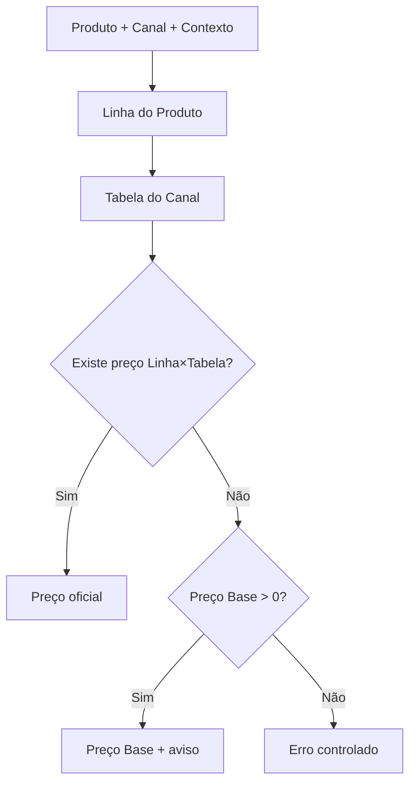
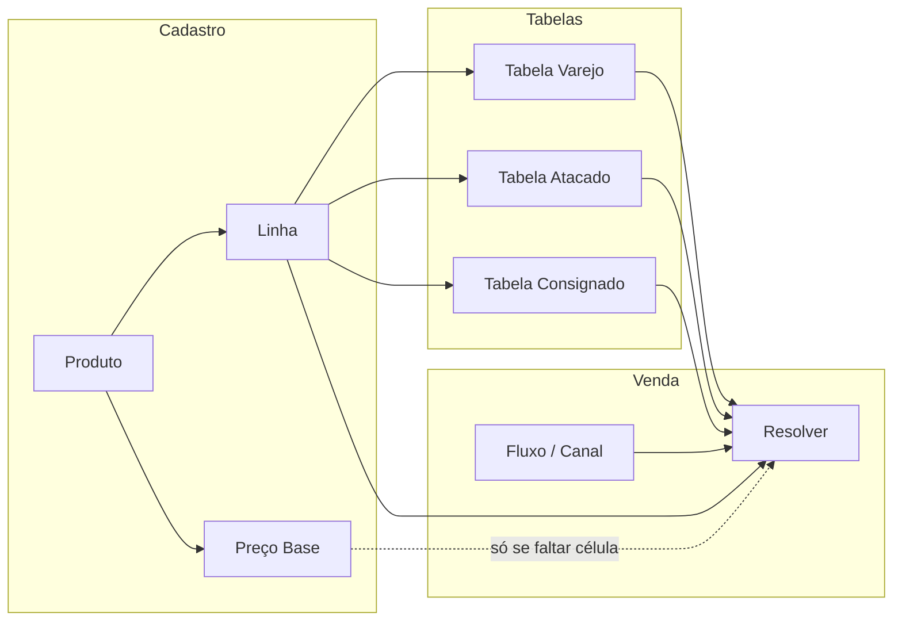

# AUDITORIA RA-6.5 — Papel do Preço Base na Arquitetura Oficial

| Campo | Valor |
|---|---|
| Tipo | Auditoria arquitetural (sem implementação) |
| Data | 2026-08-06 |
| Base | RA-6 / RA-6.3 / RA-6.4 |
| Restrição | Não altera código, migrations, banco, APIs nem UI |
| Parecer final | **B — Preço Base permanece apenas como fallback** (e âncora de cadastro/compras) |

---

## Sumário executivo

Após a RA-6.4, o **Preço Base não é mais o SSOT de venda por canal**. O fluxo oficial de venda é:

```text
Produto → Linha → Tabela do Canal → Preço
```

O Preço Base (`produtos.preco_venda`) continua com **três papéis reais**:

1. **Fallback oficial do Resolver** quando não há célula Linha×Tabela  
2. **Âncora de cadastro / formação de preço** (markup nas compras, lucro estimado)  
3. **Coluna persistida obrigatória no schema** (NOT NULL) — ainda escrita por cadastro, compras e kits  

Ele **não** deve ser tratado como “preço oficial do PDV” quando existir tabela. Também **não** pode ser eliminado agora sem plano de migração (quebra cadastro, compras, PDV sem tabela, etiquetas via fallback, kits).

---

## 1. Mapa de referências (Preço Base = `produtos.preco_venda`)

### Nomenclatura

| Nome no código / UI | Significado |
|---|---|
| `produtos.preco_venda` | Coluna DB — Preço Base |
| UI “Preço Base” | Cadastro ERP (`#preco_venda`) |
| `ORIGEM_LEGADO` / `produto.preco_venda` | Origem do Resolver no fallback |
| `preco_venda_sugerido` | Sugestão XML/compra (não é o Preço Base até gravar) |
| PDV `item.preco_base` | Preço **já resolvido** do item (canal) — **não** é a coluna Preço Base |
| `valor_venda` / totais TEF | Totais de venda — **não** é Preço Base do produto |
| `preco_padrao` | Quase inexistente no domínio comercial atual |

### Referências significativas

| Arquivo | Símbolo | ~Linha | Responsabilidade | Classificação |
|---|---|---|---|---|
| `backend/database.js` | schema `produtos.preco_venda` | ~1300 | Coluna NOT NULL | **Obrigatório (schema)** |
| `backend/modules/comercial/preco/ComercialPrecoResolver.js` | `ORIGEM_LEGADO` | 20 | Constante de origem | Fallback / legado |
| same | `extrairPrecoLegado` | ~268 | Lê `produto.preco_venda` | Fallback |
| same | `resolver` fallback | ~838–865 | Preço Base → erro controlado | Fallback **oficial** |
| same | `resolverSync` | ~873+ | Cache + legado | Fallback |
| `backend/modules/comercial/configuracao/ConfiguracaoComercialService.js` | `resolverPrecosVenda` | ~103–173 | Carrega produto + chama Resolver | Obrigatório (pipeline) |
| `backend/motores/.../pdv/PdvVendaOperacionalService.js` | load produto | ~61 | Sobrescreve preço via Resolver | Obrigatório |
| `frontend/pdv/js/pdv.js` | `resolver-precos` / carrinho | ~220–297, add item | Usa preço resolvido; bloqueia ≤ 0 | Obrigatório |
| `frontend/apps/mobile/js/pages/pdv.js` | add / resolve | ~658–832 | Idem mobile | Obrigatório |
| `frontend/modules/motor-comercial/pages/NovaConsignacao/index.js` | resolve CONSIGNADO | ~895 | Aplica `preco_venda` resolvido | Obrigatório (preço resolvido) |
| `frontend/erp/js/produtos.js` | UI Preço Base | ~2189–2200 | Cadastro | Obrigatório condicional (ou Linha) |
| same | validação save | ~3554 | `preco_venda > 0` **ou** linha | Obrigatório / condicional |
| `frontend/erp/js/compras.js` | markup / atualizar venda | ~655–864 | Formação de preço na entrada | Obrigatório (UX compras) |
| `backend/rotas/compras.js` | UPDATE `preco_venda` | ~658–674 | Persiste se flag | Obrigatório (quando marcado) |
| same | INSERT produto novo | ~477–489 | Grava `preco_venda` no create | Obrigatório |
| `backend/shared/nfe/mappers/nfeXmlMapper.js` | `preco_venda_sugerido` | ~47–48 | Sugestão custo×1.3 | Opcional |
| `backend/motores/equipamentos/services/EtiquetaMapper.js` | `obterPrecoVenda` | ~22 | Preço via Resolver | Obrigatório (etiqueta) |
| `backend/motores/equipamentos/services/ProdutoMapper.js` | `obterPrecoVenda` | ~30 | Equipamentos/balança | Obrigatório |
| `backend/motores/muc/services/ProdutoUnidadeService.js` | seed unidade | ~29–51 | Seed preço unidade via Resolver | Fallback / seed |
| `backend/modules/comercial/kits/KitService.js` | sync kit | ~88–154 | UPDATE `produtos.preco_venda` | Obrigatório (kits) |
| `backend/rotas/produtos.js` | CRUD + normalizar | ~106–144, 2050+ | Persiste coluna; resposta resolve preço | Obrigatório |
| `backend/motores/miip/**` | — | — | **Não** grava Preço Base | N/A |

---

## 2. Quem utiliza o Preço Base?

| Consumidor | Usa? | Classificação | Nota |
|---|---|---|---|
| **Resolver** | Sim | Fallback oficial | Só se não houver célula na tabela |
| **PDV** | Indireto | Fallback | Via `resolver-precos`; vende com base se tabela falhar |
| **Motor Comercial / Consignação** | Indireto | Fallback | Mesmo pipeline de resolve |
| **Compras** | Sim | Obrigatório (formação) | Markup → pode gravar `preco_venda` |
| **Fiscal** | Não direto | — | Não é SSOT fiscal |
| **Etiquetas** | Indireto | Fallback/resolvido | `EtiquetaMapper` → Resolver |
| **MUC** | Seed | Fallback / legado | Copia/resolve para unidade base |
| **MIIP** | Não | — | Identificação; custo no map de compra |
| **Importação XML** | Só sugestão | Opcional | `preco_venda_sugerido`; grava na entrada de compra |
| **Integrações / equipamentos** | Via Resolver | Fallback | ProdutoMapper |
| **Relatórios** | Pouco / nenhum exclusivo | — | Não achado relatório só de Preço Base |
| **API produtos** | Sim | Obrigatório (coluna) + resolvido na resposta | Persistência + `normalizarProdutoResposta` |
| **Dashboard** | Não crítico | — | Sem dependência exclusiva encontrada |
| **Kits** | Sim | Obrigatório | Pode sobrescrever `preco_venda` do produto kit |

---

## 3. Resolver — obrigatório ou só fallback?

**Apenas como fallback** no fluxo oficial RA-6.4.



Não há fluxo oficial em que o Preço Base seja a **primeira** fonte quando a tabela está completa.  
Há fluxos **operacionais** (produto só com base, sem tabela) em que ele é a **única** fonte — isso é compatibilidade + bootstrap, não arquitetura de canal.

---

## 4. Cadastro — o usuário precisa informar?

**Hoje:** sim, de forma prática.

- Desktop: exige `preco_venda > 0` **ou** Linha de Precificação  
- Mobile: ainda mais rígido (`preco_venda > 0`)  
- Schema: `NOT NULL`

**Arquiteturalmente (alvo):** o usuário **precisa de um preço de segurança** enquanto a Linha não estiver em todas as tabelas. Poderia, no futuro, ser:

- opcional se a Linha já tiver preço em todas as tabelas ativas, ou  
- sugerido automaticamente a partir do Varejo / markup da compra  

Enquanto a cobertura de tabelas não for garantida, **manter o campo** é correto.

---

## 5. Produto novo — nenhuma Tabela criada. Consegue vender?

**Sim**, se `preco_venda > 0`.

```text
1. Usuário cadastra Produto + Preço Base (e opcionalmente Linha)
2. PDV adiciona item → resolver-precos
3. Sem tabela do canal / sem célula → origem produto.preco_venda
4. Venda segue com esse preço (fallback: true)
```

Se Preço Base = 0 e sem célula → erro controlado / PDV bloqueia (preço ≤ 0).

---

## 6. Se TODAS as Tabelas estiverem corretas?

**Na venda:** o Preço Base **não será usado** (Resolver retorna Tabela×Linha).

**Ainda será usado em:**

- cadastro (campo persistido)  
- compras (markup / atualização)  
- kits (sync)  
- histórico de preço / margem estimada no cadastro  
- qualquer gap futuro (nova tabela sem a linha)

Conclusão: mesmo com tabelas perfeitas, a **coluna** continua útil; o **papel na venda** fica ocioso.

---

## 7. Compras — formação / markup / margem?

**Sim, participa.**

| Uso em Compras | Papel |
|---|---|
| Markup / margem na entrada | Calcula / sugere preço de venda |
| Flag `atualizar_preco_venda` | Grava em `produtos.preco_venda` |
| Produto novo na compra | INSERT já com `preco_venda` |
| XML | Só `preco_venda_sugerido` até confirmar entrada |

Não é o motor de preço por canal; é a **ponte compra → âncora de venda**.

---

## 8. Relatórios

Não foi encontrado relatório que dependa **exclusivamente** do Preço Base como SSOT de venda.

APIs de produto podem expor `preco_venda` **já resolvido** (não necessariamente a coluna crua). Risco de eliminação em relatórios: **baixo**, mas APIs/listagens que leem a coluna crua quebrariam.

---

## 9. Etiquetas

```text
EtiquetaMapper / ProdutoMapper → ComercialPrecoResolver.obterPrecoVenda(...)
```

Usa o **Resolver** (Tabela do canal quando possível; senão Preço Base).  
Não imprime “cego” a coluna — mas o fallback **é** o Preço Base.

---

## 10. PDV sem tabela

| Pergunta | Resposta |
|---|---|
| Utiliza Preço Base? | **Sim** (via Resolver) |
| É desejável? | **Sim como rede de segurança** em loja incompleta |
| Só compatibilidade? | É **compat + bootstrap** — desejável manter até cobertura 100% |

Não é desejável como estratégia permanente de precificação multi-canal; é desejável como **não-bloqueio operacional**.

---

## 11. Importação (XML / MIIP / importadores)

| Fonte | Preenche Preço Base? |
|---|---|
| XML (parse) | Não — só `preco_venda_sugerido` |
| Entrada de compra | Sim, se `atualizar_preco_venda` |
| MIIP | Não (identificação / custo) |
| Importadores genéricos | Variam; caminho oficial de venda é Resolver |

---

## 12. Riscos se o Preço Base for removido agora

| Quebra | Severidade |
|---|---|
| Schema / INSERT produto (`NOT NULL`) | Alta |
| Cadastro desktop/mobile (validação) | Alta |
| PDV / consignação sem célula na tabela | Alta (venda bloqueada) |
| Compras → atualizar preço de venda | Alta |
| Kits sync `preco_venda` | Média |
| Etiquetas / equipamentos sem tabela | Média |
| Lucro estimado no cadastro | Baixa/Média |
| Histórico `produtos_preco_historico` | Média |
| Migração MUC que assume coluna | Baixa (já migrado) |

---

## 13. Alternativas

### A) Manter Preço Base (como está no cadastro + fallback)

| Prós | Contras |
|---|---|
| Zero risco operacional | Usuário pode achar que é o preço “oficial” do PDV |
| Bootstrap sem tabela | Dois conceitos mentais (Base vs Tabela) |

### B) Transformar em Preço de Segurança / Fallback

| Prós | Contras |
|---|---|
| Alinha linguagem à RA-6.4 | Exige UX (rótulo/ajuda) |
| Mantém rede de segurança | Coluna continua existindo |

### C) Eliminar

| Prós | Contras |
|---|---|
| Modelo mental único (só tabela) | Quebra ampla; exige cobertura 100% Linha×Tabela |
| — | Compras/markup precisam de novo destino |

### D) Outro modelo

Ex.: Preço Base = espelho automático do Varejo (não editável).  
Útil no longo prazo; **não** é eliminação — é sincronização.

---

## 14. Parecer final

### Opções

| | |
|---|---|
| A | Preço Base continua obrigatório (como SSOT de venda) |
| **B** | **Preço Base permanece apenas como fallback** |
| C | Preço Base pode ser eliminado |
| D | Outro modelo |

### Escolha: **B**

**Justificativa técnica**

1. RA-6.4 já fixou a venda em Linha → Tabela do Canal.  
2. O Preço Base ainda é o único caminho seguro sem tabela/célula.  
3. Compras, schema e cadastro ainda dependem da coluna.  
4. Eliminar (C) agora viola “sem regressão”.  
5. Tratar como SSOT obrigatório de venda (A) contradiz a arquitetura oficial.

**Leitura oficial do conceito:**

```text
Preço Base = âncora de cadastro + rede de segurança do Resolver
           ≠ preço oficial por canal
```

### Direção futura (sem implementar nesta auditoria)

| Fase | Ação |
|---|---|
| Agora | Congelar parecer B; UX: deixar claro “fallback / segurança” |
| Depois | Cobertura Linha em todas as tabelas ativas |
| Opcional | Tornar campo não-obrigatório se Linha coberta |
| Longe | Avaliar eliminação ou espelho do Varejo (plano abaixo) |

---

## Plano de migração (somente se no futuro optar por eliminar)

> Só executar após cobertura comprovada. **Não fazer agora.**

### Fase 0 — Métricas
- % produtos com Linha  
- % Linhas presentes em Tabelas Varejo/Atacado/Consignado  
- % vendas com `origem = produto.preco_venda`

### Fase 1 — UX
- Renomear mentalmente para “Preço de Segurança”  
- Aviso quando venda usar fallback  

### Fase 2 — Soft
- Cadastro: Preço Base opcional se Linha coberta em tabelas ativas  
- Compras: gravar preferencialmente na Tabela Varejo (não só na coluna)  

### Fase 3 — Hard cut (só com gate)
- Resolver: remover `ORIGEM_LEGADO`  
- Schema: permitir NULL / deprecar coluna  
- PDV: bloquear se sem célula (já quase assim com base 0)  

### Critério de go/no-go
- 0 vendas em fallback por N dias em produção  
- 100% SKUs ativos com Linha + preço Varejo  

---

## Diagrama de responsabilidades



---

## Conclusão

O Preço Base **ainda possui papel arquitetural próprio**, mas **estreito**:

- não é o agregador (isso é a Linha)  
- não é o contexto (isso é a Tabela/Canal)  
- é o **fallback oficial + âncora de cadastro/compras**

**Congelar como B.** Não eliminar. Não restaurar como SSOT de venda.

---

**Fim da auditoria RA-6.5.** Nenhuma alteração de código, migration, banco, API ou UI foi feita neste entregável.
