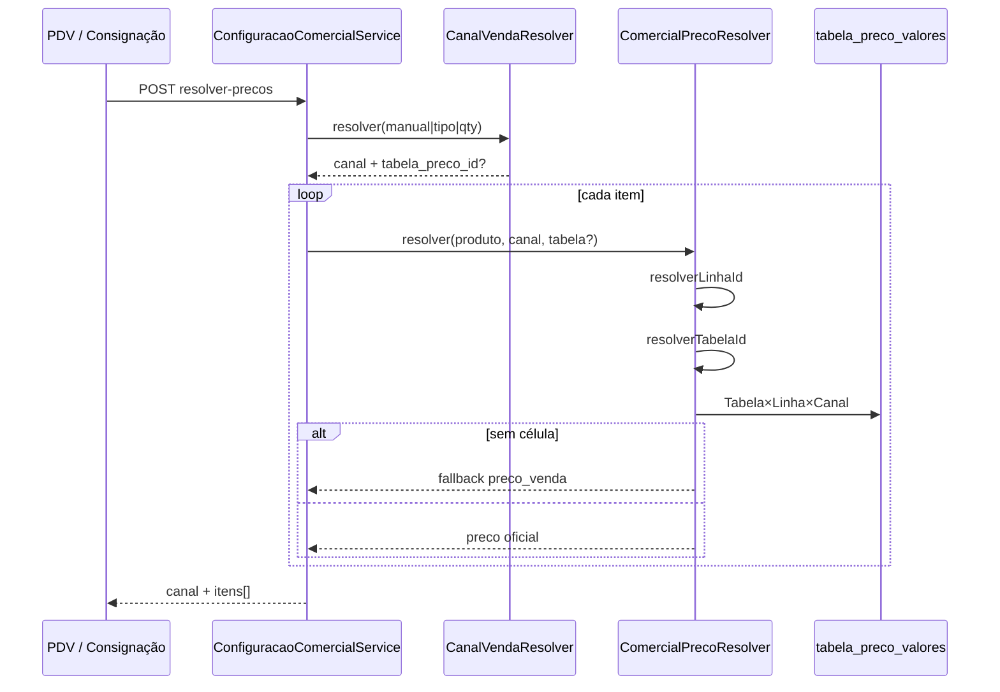

# AUDITORIA RA-7.6 — Resolver Comercial

| Campo | Valor |
|---|---|
| Sprint | RA-7.6 |
| Data | 2026-08-06 |
| Escopo | Auditoria do fluxo Produto → Linha → Canal → Tabela → Preço |
| Restrição | Somente leitura |

---

## Veredito

O Resolver oficial está implementado e é a **única fonte de preço** para PDV/Consignação via `POST /api/configuracao-comercial/resolver-precos`.  
Canal e Tabela vêm do **contexto da operação**, não do produto.

---

## 1. Fluxo oficial (RA-6.6)

```text
Produto
  └─ Linha de Precificação     (produto.linha_comercial_id / política / categoria legado)
       └─ Canal da operação    (CanalVendaResolver)
            └─ Tabela do Canal (ativa mono-canal / contexto / padrão)
                 └─ Célula     tabela_preco_valores (Tabela × Linha × Canal)
                      └─ Preço (+ Unidade Comercial; vazio = Unidade Base)
                           └─ Fallback → preço de segurança (produto.preco_venda)
```

Arquivos-núcleo:

| Papel | Arquivo |
|---|---|
| Canal | `backend/modules/comercial/preco/CanalVendaResolver.js` |
| Preço | `backend/modules/comercial/preco/ComercialPrecoResolver.js` |
| Orquestração | `backend/modules/comercial/configuracao/ConfiguracaoComercialService.js` → `resolverPrecosVenda` |
| Rota | `POST .../configuracao-comercial/resolver-precos` |

---

## 2. Quem informa o Canal?

`CanalVendaResolver.resolver(opts)`:

| Prioridade | Fonte | Quem passa |
|---|---|---|
| 1 | `canal_manual` / `body.canal` | PDV (EVENTO), Consignação (`CONSIGNADO`) |
| 2 | Tipo Comercial | `cliente_id` / `tipo_comercial_*` |
| 3 | Automático VAREJO/ATACADO | Itens + `quantidade_minima` + `participa_atacado` + regras da Tabela Atacado |

---

## 3. Quem escolhe a Tabela?

`ComercialPrecoResolver.resolverTabelaId(opts, produto)`:

1. `opts.tabela_preco_id` (contexto da venda / retorno do CanalResolver / body)
2. Tabela **ativa** do canal (`TabelasPrecoRepository.buscarAtivaPorCanal`)
3. `configuracao_comercial.tabela_preco_padrao_id`
4. Tabela `PADRAO` / primeira ativa

**`produto.tabela_preco_id` é ignorado** no fluxo oficial (RA-6.8).

---

## 4. Quem consulta o preço?

Somente `ComercialPrecoResolver.resolver()`.

Célula oficial: `buscarPrecoTabelaLinha(tabelaId, linhaId, canal)` → `tabela_preco_valores`.

Consumidores: Config Comercial, `ProdutoPlatformGateway` (consignação), `PdvVendaOperacionalService`, etiquetas, diagnóstico, etc.

---

## 5. Fallback

Ordem após falha da célula oficial:

| # | Origem | Constante |
|---|---|---|
| 1 | Tabela × Linha × Canal | `ORIGEM_TABELA_LINHA` |
| — | Se tabela+linha existem sem célula → **pula compat** (`pularCompat`) | |
| 2 | Tabela × Produto × Canal (compat) | `ORIGEM_TABELA_PRODUTO` |
| 3 | Linha × Canal legado | `ORIGEM_LINHA` |
| 4 | Tabela × Canal sem linha | `ORIGEM_TABELA` |
| 5 | `produto.preco_venda` | `ORIGEM_LEGADO` (`fallback: true`) |

Efeito prático: se a Tabela Atacado existe mas **não tem preço na linha**, o sistema cai no preço de segurança — **mesmo preço aparente** entre canais.

---

## 6. Cache

- `Map` em memória (`cachePreco`)
- Chaves: `T:`, `TL:`, `L:` (+ legado sem prefixo)
- Invalidação: `invalidateCache` / `invalidateCacheLinha` ao salvar tabelas/linhas
- `aquecerCacheCanal`, `resolverSync` (somente cache)

---

## 7. Log

- `logResolucao()` → `console.log('[Comercial]...')`
- Liga se `COMERCIAL_PRECO_LOG !== '0'`
- Erros de SQL: `console.error('[Comercial] Erro ao consultar...')`

---

## 8. Achado relevante (orquestração)

Em `ConfiguracaoComercialService.resolverPrecosVenda`, ao calcular referência VAREJO para economia de atacado, o código reutiliza `tabelaOpts` (que pode ser a **tabela do canal ATACADO**).

Isso pode:

- distorcer `preco_varejo` / `desconto_atacado` na UI;
- mascarar diferença real entre tabelas.

**Não corrigido nesta sprint** (auditoria only). Recomendação: referência VAREJO sem forçar `tabela_preco_id` do canal atual.

---

## 9. Diagrama de sequência


